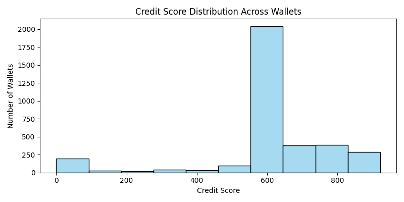

# Analysis of Wallet Credit Scores

## 📊 Score Distribution

The following histogram shows how wallet credit scores are distributed across ranges:

### ✅ Wallet Count per Score Range:

| Score Range  | Number of Wallets |
|--------------|-------------------|
| 0–100        | 12                |
| 101–200      | 29                |
| 201–300      | 22                |
| 301–400      | 40                |
| 401–500      | 54                |
| 501–600      | 251               |
| 601–700      | 2124              |
| 701–800      | 411               |
| 801–900      | 262               |
| 901–1000     | 109               |

---

## 🟥 Behavior of Low-Scoring Wallets (0–400)

- Typically have **low or zero repayments**
- Often exhibit **high borrow-to-deposit ratios**
- Some were involved in **liquidation events**
- Showed **short usage duration** and minimal activity
- May reflect **bot-like or high-risk behavior**

---

## 🟩 Behavior of High-Scoring Wallets (700–1000)

- Demonstrate **consistent repayments**
- Borrow within responsible limits compared to deposits
- No liquidation activity observed
- Exhibit **longer protocol usage periods**
- High transaction counts indicating **trustworthy activity**

---

## 📌 Insights

- Most wallets score between **600–700**, indicating moderate trust levels.
- Very few wallets fall into the extreme **low (0–100)** or **high (900–1000)** score range.
- **Liquidations and over-borrowing** are the top indicators of risk.
- **Good repayment behavior and longevity** significantly improve scores.

---

## 📈 Suggestions for Improvement

- Incorporate time-weighted features (e.g., recent vs. older transactions).
- Add clustering to identify wallet behavior patterns more robustly.
- Use anomaly detection or supervised ML for fraud/risk prediction if labeled data is available.

---
